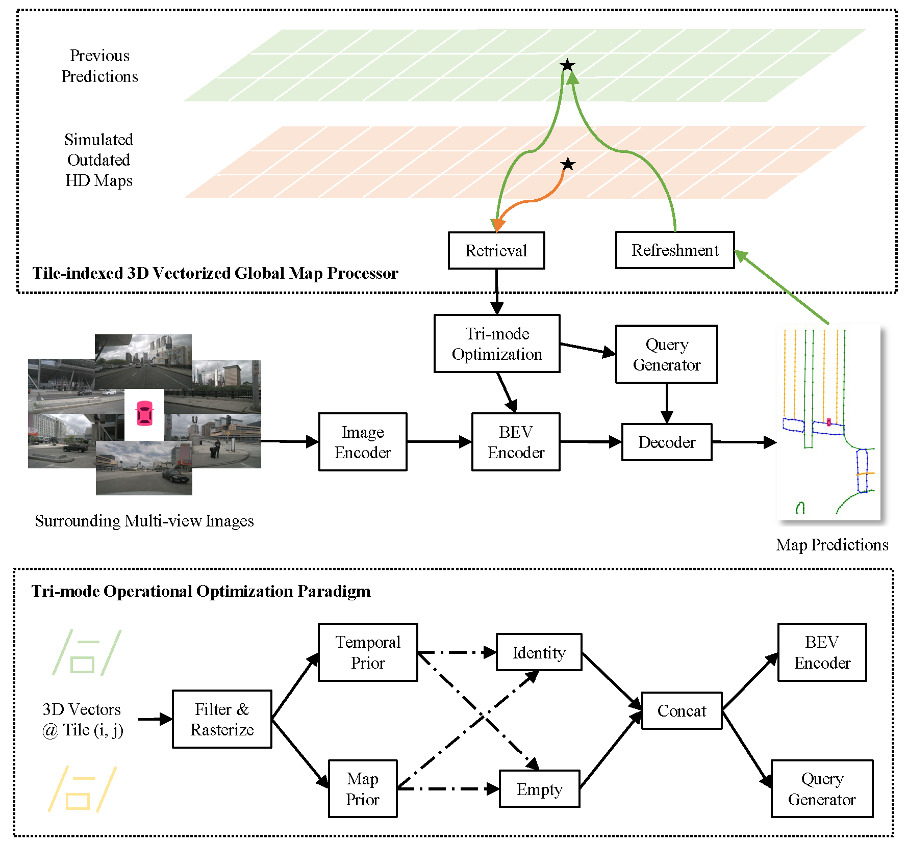
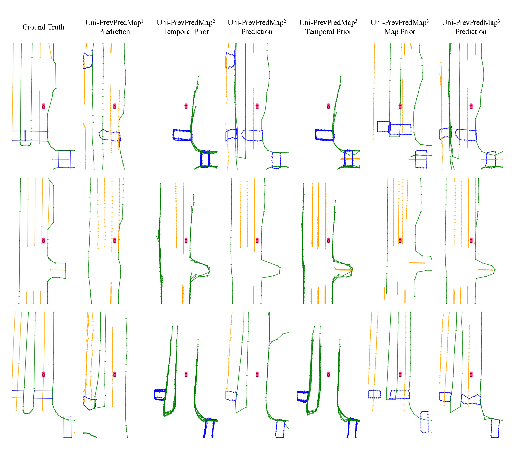

<div align="center">
  <h1>Uni-PrevPredMap</h1>
  
  <h3> Uni-PrevPredMap: Extending PrevPredMap to a Unified Framework of Prior-Informed Modeling for Online Vectorized HD Map Construction </h3>
  
  [](https://arxiv.org/abs/2504.06647)
  
</div>

## Introduction
This repository is an official implementation of Uni-PrevPredMap.

## Overview

This project introduces a unified prior-informed framework that systematically integrates two synergistic information sources: previous predictions and simulated outdated HD maps. The framework introduces two core innovations: a tile-indexed 3D vectorized global map processor enabling efficient refreshment, storage, and retrieval of 3D vectorized priors; a tri-mode operational optimization paradigm ensuring consistency across non-prior, temporal-prior, and temporal-map-fusion-prior scenarios while mitigating reliance on idealized map fidelity assumptions. 

## Visualization

This image displays prediction comparison of Uni-PrevPredMap in three modes: Uni-PrevPredMap<sup>1</sup>, Uni-PrevPredMap<sup>2</sup>, and Uni-PrevPredMap<sup>3</sup> denote non-prior, temporal-prior and temporal-map-fusion-prior modes, respectively. Corresponding priors are illustrated to demonstrate their influence. Green, orange and blue lines represent road boundaries, lane dividers and pedestrian crossings, respectively.

## Models

#### nuScenes dataset

plz stay tuned

#### ArgoVerse2 dataset

plz stay tuned

## Getting Started
These settings are mostly the same as [MapTRv2](https://github.com/hustvl/MapTR/tree/maptrv2)
- [Installation](docs/install.md)
- [Prepare Dataset](docs/prepare_dataset.md)
- [Train and Eval](docs/train_eval.md)
- [Visualization](docs/visualization.md)

## Acknowledgements

PrevPredMap is based on [MapTRv2](https://github.com/hustvl/MapTR/tree/maptrv2) and [mmdetection3d](https://github.com/open-mmlab/mmdetection3d). It is also greatly inspired by the following outstanding contributions to the open-source community: [HRMapNet](https://github.com/HXMap/HRMapNet), [GroupDETR](https://github.com/Atten4Vis/GroupDETR), [BEVFormer](https://github.com/fundamentalvision/BEVFormer), [GKT](https://github.com/hustvl/GKT).

## Citation
If you find Uni-PrevPredMap is useful in your research or applications, please consider giving us a star 🌟 and citing it by the following BibTeX entry.
```bibtex
@article{peng2025uni,
  title={Uni-PrevPredMap: Extending PrevPredMap to a Unified Framework of Prior-Informed Modeling for Online Vectorized HD Map Construction},
  author={Peng, Nan and Zhou, Xun and Wang, Mingming and Chen, Guisong and Xu, Wenqi},
  journal={arXiv preprint arXiv:2504.06647},
  year={2025}
}
```
