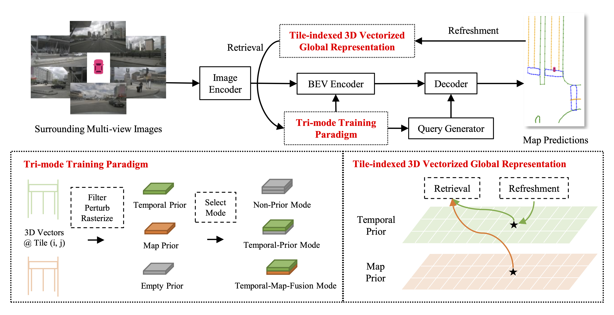
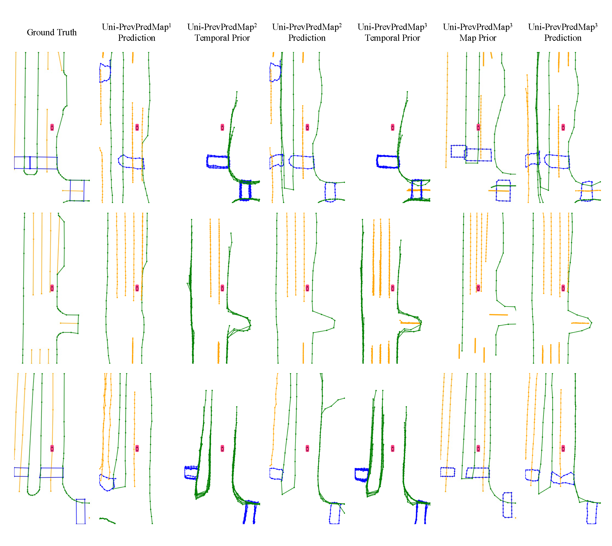

<div align="center">
  <h1>Uni-PrevPredMap</h1>
  
  <h3> Uni-PrevPredMap: Extending PrevPredMap to a Unified Framework of Prior-Informed Modeling for Online Vectorized HD Map Construction </h3>
  
  [](https://doi.org/10.1109/LRA.2026.3729481)
  [](https://arxiv.org/abs/2504.06647)
  
</div>

## News
- **[2026-09]** Accepted to IEEE Robotics and Automation Letters (RA-L).

## Introduction
This repository is an official implementation of Uni-PrevPredMap.

## Overview

This project introduces a unified prior-informed framework for online vectorized HD map construction. It treats two complementary yet individually imperfect information sources — temporal predictions and cost-efficient HD map priors — within a single pipeline through their common vectorized representation.

The framework has two core components: a tile-indexed 3D vectorized global representation that enables efficient refreshment, storage, and localized retrieval of 3D vectorized priors; and a tri-mode training paradigm that exposes the model to non-prior, temporal-prior, and temporal-map-fusion conditions, so that a single model perceives reliably without any prior, exploits priors when available, and stays robust when priors are imperfect.

## Visualization

This image displays prediction comparison of Uni-PrevPredMap in three modes: Uni-PrevPredMap<sup>1</sup>, Uni-PrevPredMap<sup>2</sup>, and Uni-PrevPredMap<sup>3</sup> denote non-prior, temporal-prior and temporal-map-fusion-prior modes, respectively. Corresponding priors are illustrated to demonstrate their influence. Green, orange and blue lines represent road boundaries, lane dividers and pedestrian crossings, respectively.

## Models

#### nuScenes dataset

| Method  | Backbone | Epoch | Divider | Ped. Crossing | Boundary | mAP | Config | Download |
|:----:|:----:|:-----:|:----:|:----:|:----:|:----:|:----:|:----:|
| Uni-PrevPredMap | R50 | 24 | 72.4 | 75.8 | 73.7 | 74.0 | [config](projects/configs/uniprevpredmap/uniprevpredmap_nusc_r50_24ep.py) | [model & log](https://drive.google.com/drive/folders/1Wj1YNQY255_GAzEsnQkr5qUCjKS0fGOV?usp=sharing) |
| Uni-PrevPredMap* | R50 | 24 | 83.9 | 77.7 | 79.9 | 80.5 | ↑ | ↑ |

> **Note:** Numbers in this table are from the released checkpoints. The paper
> reports separate runs of the same configurations, so per-class results may
> differ by a few tenths of a point due to run-to-run variance.

#### ArgoVerse2 dataset

| Method  | Backbone | Epoch | Divider | Ped. Crossing | Boundary | mAP | Config | Download |
|:----:|:----:|:-----:|:----:|:----:|:----:|:----:|:----:|:----:|
| Uni-PrevPredMap | R50 | 6† | 75.7 | 69.3 | 73.0 | 72.7 | [config](projects/configs/uniprevpredmap/uniprevpredmap_av2_3d_r50_6ep.py) | [model & log](https://drive.google.com/drive/folders/1h3Brmn8Cl9UiEWTD2nyUdbqYJi3KgFes?usp=sharing) |
| Uni-PrevPredMap* | R50 | 6† | 83.1 | 74.5 | 80.3 | 79.3 | ↑ | ↑ |

† `total_epochs=24` with `partial=4` in the sampler (25% of the training set per epoch, re-sampled each epoch), equivalent to 6 full-data epochs in total
iterations. Argoverse2 is sampled at 10Hz, so subsampled-epoch schedules are standard practice; we report the equivalent full-data epoch count for comparability.

## Getting Started
These settings are mostly the same as [MapTRv2](https://github.com/hustvl/MapTR/tree/maptrv2)
- [Installation](docs/install.md)
- [Prepare Dataset](docs/prepare_dataset.md)
- [Train and Eval](docs/train_eval.md)
- [Visualization](docs/visualization.md)

## Acknowledgements

Uni-PrevPredMap is based on [MapTRv2](https://github.com/hustvl/MapTR/tree/maptrv2) and [mmdetection3d](https://github.com/open-mmlab/mmdetection3d). It is also greatly inspired by the following outstanding contributions to the open-source community: [HRMapNet](https://github.com/HXMap/HRMapNet), [GroupDETR](https://github.com/Atten4Vis/GroupDETR), [BEVFormer](https://github.com/fundamentalvision/BEVFormer), [GKT](https://github.com/hustvl/GKT).

## Citation
If you find Uni-PrevPredMap is useful in your research or applications, please consider giving us a star 🌟 and citing it by the following BibTeX entry.
```bibtex
@ARTICLE{peng2026uniprevpredmap,
  author={Peng, Nan and Zhou, Xun and Wang, Mingming and Chen, Guisong and Xu, Wenqi},
  journal={IEEE Robotics and Automation Letters},
  title={Uni-PrevPredMap: Extending PrevPredMap to a Unified Framework of Prior-Informed Modeling for Online Vectorized HD Map Construction},
  year={2026},
  volume={11},
  number={10},
  pages={12032--12039},
  doi={10.1109/LRA.2026.3729481}
}
```
